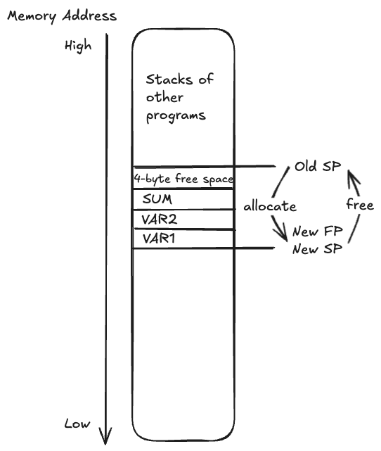
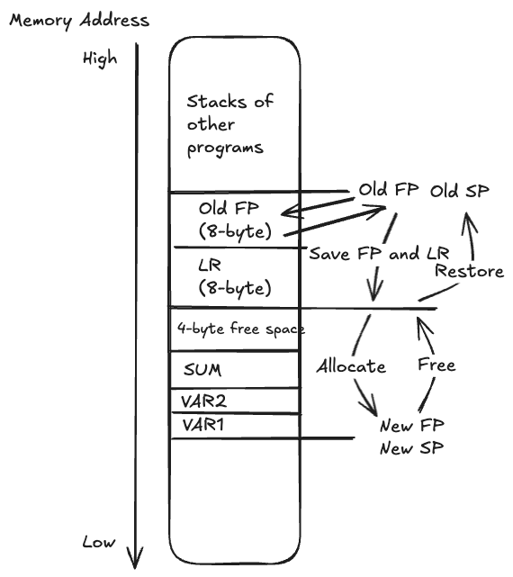

# Note and Exercises from Programming with 64-Bit ARM Assembly Language (2020)

# Set Registers
## Shifting bits
- `LSL #nbits` Logical shift left by `nbits`.
- `LSR #nbits` Logical shift right by `nbits`.
- `ASR #nbits` Arithmetic shift right by `nbits`, keeping signed bit on the left.
- `ROR #nbits` Rotate right by `nbits`.

## Move value into register
`MOV` can move into register only 16-bit at a time. So to load a 64-bit value, we need to shift a maximum of 4 times with `MOVK`.

`MOV  Xd, #imm16` moves `imm16` into `Xd`<br/>
`MOVK Xd, #imm16` moves `imm16` into `Xd` while keeping original data in `Xd`<br/>
`MOVK Xd, #imm16, LSL #4` logical shift left `imm16` by 4-bits<br/>
`MOVN Xd, #imm16` moves logical NOT of `imm16` into `Xd`

# Arithmetics
## ADD(S) and SUB(S)

The basic form of `ADD` and `SUB` adds/substracts `Xs` with `Operand2`, then store the result in `Xd`.

```asm
ADD{S}      Xd, Xs, Operand2 
ADC{S}      Xd, Xs, Operand2 

SUB{S}      Xd, Xs, Operand2
SBC{S}      Xd, Xs, Operant2
```

There are cases where a number might be greater than 64-bit, so we need multiple registers. `ADDS` and `SUBS` does the same work as `ADD` and `SUB`, but also adds a carry/borrow condition in the `NZCV` register.

Think about [carry and borrow](https://en.wikipedia.org/wiki/Carry_(arithmetic)) in arithmetic. The `NZCV` register is the 1 when you do carry/borrow.

The `ADC`/`SBC` works based on the previous `ADDS`/`SUBS` carry/borrow condition. The `ADCS`/`SBCS` sets the carry/borrow just like `ADDS`/`SUBS`.

Example:
```asm
// Simple addition/subtraction with one register sized-number
ADD     X0, X1, #4  // X0 = X1 + 4
SUB     X2, X3, X4 // X2 = X3 - X4

// Adding and subtracting a 192-bit number
ADDS    X0, X3, #1  // Add lower bits and set carry
ADCS    X1, X4, #1  // Add middle bits with carry, and set a new carry
ADC     X2, X5, #1  // Add higher bits with carry

SUBS    X0, X3, #1  // Subtract lower bits and set borrow
SBCS    X1, X4, #1  // Subtract middle bits with borrow, and set a new carry
SBC     X2, X5, #1  // Subtract higher bits with borrow
```

## NZCV Register (aka CPSR)
Comparisons, `ADDS`/`SUBS`, or `S`-variant logical operators sets the `NZCV` register (`CPSR` in ARM) used for branching.

https://developer.arm.com/documentation/100069/0606/Condition-Codes/Condition-code-suffixes-and-related-flags

| Suffix | Flags                | Meaning                                      |
|--------|----------------------|----------------------------------------------|
| EQ     | Z set                | Equal                                        |
| NE     | Z clear              | Not equal                                    |
| CS or HS | C set              | Higher or same (unsigned >=)                 |
| CC or LO | C clear            | Lower (unsigned <)                           |
| MI     | N set                | Negative                                     |
| PL     | N clear              | Positive or zero                             |
| VS     | V set                | Overflow                                     |
| VC     | V clear              | No overflow                                  |
| HI     | C set and Z clear    | Higher (unsigned >)                          |
| LS     | C clear or Z set     | Lower or same (unsigned <=)                  |
| GE     | N and V the same     | Signed >=                                    |
| LT     | N and V differ       | Signed <                                     |
| GT     | Z clear, N and V the same | Signed >                        |
| LE     | Z set, N and V differ| Signed <=                                    |
| AL     | Any                  | Always. This suffix is normally omitted.     |

## Multiply and Divide

## Multiply

`MUL` only saves the lower 64-bit of the multiplication from two 64-bit registers:
```asm
// Multiply Xn by Xm and store the lower 64-bit in Xd
MUL     Xd, Xn, Xm
```

`SMULH` and `UMULH` saves the upper 64-bit of multiplication:
```asm
// Signed upper 64-bit
SMULH   Xd, Xn, Xm

// Unsigned upper 64-bit
UMULH   Xd, Xn, Xm
```

Multiply two 32-bit registers and store full result in 64-bit register:
```asm
// Signed
SMULL   Xd, Wn, Wm

// Unsigned
UMULL   Xd, Wn, Wm
```

Negatives of multiplication:
```asm
// Calculates -(Xn * Xm)
MNEG    Xd, Xn, Xm

// Signed 32-bit version
SMNEGL  Xd, Wn, Wm

// Unsigned 32-bit version
UMNEGL  Xd, Wn, Wm
```

## Accumulate

Does multiplication with accumulation:
- `ADD` ones: `Xd = Xa + Xn * Xm`
- `SUB` ones: `Xd = Xa - Xn * Xm`
- `Xa` can be the same as `Xd`
- Similarly for `W` register ones
```asm
MADD    Xd, Xn, Xm, Xa
MSUB    Xd, Xn, Xm, Xa

// 32-bit variants
SMADDL  Xd, Wn, Wm, Xa
UMADDL  Xd, Wn, Wm, Xa
SMSUBL  Xd, Wn, Wm, Xa
UMSUBL  Xd, Wn, Wm, Xa
```


## Divide
```asm
// Signed divide Xn by Xm and store in Xd
SDIV    Xd, Xn, Xm

// Unsigned divide Xn by Xm and store in Xd
UDIV    Xd, Xn, Xm
```
Divide doesn't throw division by zero error, but just returns 0.

# Condition
> Condition is bad for performance!
## Comparison
Usually `CMP` comparing two registers by substraction.<br/>
`CMN`: Uses addition instead of subtraction.<br/>
`TST`: Performs a bitwise AND operation between Xn and Operand2.<br/>

Comparison stores the result in the `NZCV` register, to be used later with branching instruction.

## Branching

Branching retrieves the `NZCV` registers value and performs condition based on it.

```asm
// Jump to branch without testing condition
B   branch_name

//  Jump to function
BL  function_name
```

```asm
CMP X1, X2 // Or SUBS X2, X2, #1, which means testing if X2 reaches 0

// Use comparison value stored in NZCV register to determine condition
B.{condition} branch_name

cont:
// continue

branch_name:
// Do some work in branch
B cont // Go to cont
```

## Looping
```asm
// W2-- until W2 is 0
loop:
    SUBS W2, W2, #1  // Note the S at the end of SUBS
    B.NE loop  // Go to loop if not equal
```

# Logical Operators
`AND` is useful for masking bits with Operand2, `ORR` is useful for setting bits.

`S` variant sets the `NZDV` register.

```asm
AND{S} Xd, Xs, Operand2  // Bitwise AND between Xs and Operand2
EOR{S} Xd, Xs, Operand2  // Bitwise XOR between Xs and Operand2
ORR{S} Xd, Xs, Operand2  // Bitwise OR between Xs and Operand2
BIC{S} Xd, Xs, Operand2  // Bitwise Xs AND NOT Operand2
```


# Macro and Function

Two ways of importing:
- Include: In main, use `.include "file.s"`. The file won't need to be assembled to `.o` file.
- Assemble then link:
    `.global func_name` makes `func_name` function available for other programs.<br/>
    Only one program can be called `_start`.<br/>

`gcc` compiles `.S` file with C-style includes with capital S.

## Macro
> Good for performance, bad for conserving memory.<br/>Inserts copy of the code at every point used, so no need to push/pop stack.

Example:
```asm
.MACRO macroname parameter1, parameter2,...
2:
    // Some work
    B.NE 2b
    B 1f
    // ...
1:
    // Some other work
.ENDM
```
If macro is used multiple times, duplicate text labels will create conflict. ARM allows using duplicate numeric labels like 1, 2, 3...

e.g.:
- `2b` - label 2 in backward direction
- `1f` - label 1 in forward direction

## Function
> Bad for performance, good for conserving memory. Usually needs to push/pop stack when calling.

`BL func_name` calls the `func_name` function.
`RET` in the function returns with result in `X0` register.

Registers:
- `X0-X7` - Argument registers. Function parameters that can be used by the function.
- `X0-X18` might be corrupted after running the function, so any value must be **saved to stack before calling function**.
- `X19-X30` - Callee-saved registers. Caller assumes they stay unchanged. If used by the function, must be **saved within the function and restored before return**.
- `LR` stores where the next instruction is after function, so must be saved to stack if calling a nested function within the function.
    - Calling `RET` resumes execution from current `LR` pointed instruction.
> See Page 143 ARM 64 assembly book

### Function Integration with C/Python

**Using Extern**<br/>
When you use it as an extern, e.g.:
```C
extern int mytoupper( char *, char * );
```
- The first `char*` input goes to `X0`, the second `char*` input goes to `X1`, and so on...
- The returned int goes to `X0`

---

**Using Inline**<br/>
When you use it inline, e.g.:
```C
__asm__ volatile(
        "mov    X3, %2\n"
        "loop:\n"
        "LDRB   W4, [%1], #1\n"
        "CMP    W4, #'A'\n"
        // ...
        "SUB    %0, %2, X3\n"
        
        : "=r"(len)  // OutputOperands: "=r"(len) means write to operand, corresponds to %0 in the asm
        : "r"(str), "r"(outBuf) // InputOperands: "r"(str) means input with variable "str". str and outBuf corresponds to %1 and %2 in the asm
        : "r3", "r4"); // Clobbers: registers that might be used by the asm so C compiler will avoid (note it is r not X or W)
```
- The output is aliased as `%0`
- The input variables start from `%1`, `%2`, and so on...

# Memory Access
## Load and store register from memory
Square bracket on `[X0]` signifies load from the memory address stored in X0, not the register content of X0.<br/>
Even though the stack grows downward, the memory save and load instructions access low -> high memory address.
```asm
// load the address of mynumber into X1
LDR X1, =mynumber

// load the word stored at mynumber into X2
LDR X2, [X1]

.data
mynumber: .QUAD 0x123456789ABCDEF0 
```
To load types other than word or quad, and pad correctly:
```asm
LDR{type} Xt, [Xa] 
```
Type can be one of the following:

| Type | Meaning                |
|------|------------------------|
| B    | Unsigned byte          |
| SB   | Signed byte            |
| H    | Unsigned halfword (16 bits) |
| SH   | Signed halfword (16 bits)   |
| SW   | Signed word            |

## Index change while loading/saving
- Pre-indexing:<br/>
    `STP LR, FP, [SP, #-16]!`<br/>
    > Memory address updated
    1. `SP` is first updated to `SP = SP - 16`
    2. Then `LR` and `FP` are stored in increasing memory address from the new `SP` address (`LR -> [SP]` and `FP -> [SP + #8]`)

- Post-indexing:<br/>
    `LDR LR, FP, [SP], #16`<br/>
    > Memory accessed first
    1. `LR` and `FP` are loaded from `SP` and `SP + 8`
    2. Then SP is updated to `SP = SP + 16` after the memory operation

Example:
```asm
// Assume X0 = 0x1000
// Load memory content from 0x1000 + 16 = 0x1010 to 0x1017
LDR X1, [X0, #16]

// Update X0 to 0x1010, then load memory content from 0x1010 to 0x1017
LDR X1, [X0, #16]!

// Load memory from 0x1000-0x1008, then update X0 to 0x1010
LDR X1, [X0], #16

// Similarly for STR operations
```

## Stack and Stack Frame

Stack Pointer (SP) grows downwards by 16 byte aligned on ARM. Non-16-byte aligned address will crash.
> Wastes memory if variables are not using all 16-byte, can be addressed by using Frame Pointer (FP)

> Note there seems to be discrepancy between what is described in the book and online about whether FP should match SP or be at an offset. Here we follow the book. See [this StackOverflow Discussion](https://stackoverflow.com/questions/66143047/is-it-valid-for-the-stack-pointer-and-frame-pointer-to-point-to-the-same-address).



`X29` register is aliased as Frame Pointer (FP), and set address relative to FP

```asm
// Assume SP = 0x1000

// Positive memory offsets relative to FP
.EQU    VAR1, 0
.EQU    VAR2, 4
.EQU    SUM,  8

SUB   FP, SP, #16
SUB   SP, SP, #16
// Now FP == SP are both 0x0FF0
// Address 0x0FF0 - 0x0FFF can be used

LDR W4, [FP, #VAR1]  // W4 loads from 0x0FF0
LDR W5, [FP, #VAR2]  // W5 loads from 0x0FF4
SUM W6, W4, W5
STR W6, [FP, #SUM]   // Store sum at 0x0FF8
```

Save LR and previous program's FP with the first 16-byte:


```asm
// Assume SP = 0x1000, Old FP = 0x1000

// Positive memory offsets relative to FP
.EQU    VAR1, 0
.EQU    VAR2, 4
.EQU    SUM,  8

// Store old FP and LR pair, now SP at 0x0FF0
STP   FP, LR, [SP, #-16]!

// Allocate stack
SUB   FP, SP, #16
SUB   SP, SP, #16
// Now FP == SP are both 0x0FE0
// Address 0x0FE0 - 0x0FF0 can be used

LDR W4, [FP, #VAR1]  // W4 loads from 0x0FE0
LDR W5, [FP, #VAR2]  // W5 loads from 0x0FE4
SUM W6, W4, W5
STR W6, [FP, #SUM]   // Store sum at 0x0FE8

// Free Stack
ADD   FP, SP, #16
ADD   SP, SP, #16
// Now FP == SP are both 0x0FF0

// Restore old FP and LR pair, now SP at 0x1000
LDP   FP, LR, [SP], #16
```

## `.text` and `.data` part

`.text` defines immutable constants. `.data` defines mutable variables.

`.fill` directive is similar to `calloc()` in C, where addresses are filled with an initial value. `.fill 255, 1, 0` fills `255` elements, each of size `1` and value `0`.

`.asciz` defines `ascii` char array with null-termination. `.ascii` doesn't provide null-termination.

# Unix/Linux System Service
## Registers
`X0`-`X7` registers are used for parameters.<br/>
`X8` register is used for specifying service to call.<br/>
`SVC 0` means introduce software interrupt to call the service.<br/>
Return code is saved in `X0`.

Calculate string size example:

```asm
inpErr: .asciz	"Failed to open input file.\n"
inpErrsz: .word  .-inpErr 
```

`.` means current address, so `inpErrsz` calculates current memory address - start of inpErr -> inpErr's size.

# Floating-Point Calculation
> Floating-point calculation introduces rounding errors over time, hence use fixed calculation in financial settings.

## Registers
ARM FPU and NEON coprocessor shared registers:<br/>
`V0` - `V31` 128-bit registers.
`D0` - `D31` is 64-bit double-precision version.
`S0` - `S31` is 32-bit single-precision version.
`H0` - `H31` is 16-bit half-precision version.

`V0` - `V7` are caller saved.
`V8` - `V15` are callee saved.

NEON coprocessor labels `V0` - `V31` as `Q0` - `Q31` for 128-bit integers.

## FMOV
Use `FMOV` to move between FPU registers and CPU registers
```asm
FMOV H1, W2 
```

## FADD/FSUB
There are floating point versions of `ADD`, `SUB`, `MUL`, `DIV`, with `F` in the beginning like `FADD`.

There are also:
```asm
FNEG
FABS
FMAX
FMIN    
FSQRT   Sd, Sn  // Sd = Sn^2
```

## FCVT

`FCVT` converts between single and double precisions.

There are also instructions to convert between floating-point and integers. e.g.:
```asm
SCVTF   Dd, Xm  // Signed integer to double FP
UCVTF   Sd, Wm  // Unsigned integer to single FP
```

# More Conditional

## CSEL and CSINC
Conditional select and conditional increase.
```asm
// Xd = Xn if condition is true, else Xd = Xm
CSEL    Xd, Xn, Xm, condition

// Xd = Xn if condition is true, else Xd = Xm + 1
CSINC   Xd, Xn, Xm, condition
```

# NEON Coprocessor
NEON coprocessor can process data in parallel with SIMD (Single Instruction Multiple Data). It divides the 128-bit register into different lanes, then process instructions in parallel between lanes.

Check out ARN website on the lanes concept: https://developer.arm.com/documentation/102474/0100/Fundamentals-of-Armv8-Neon-technology/Registers--vectors--lanes-and-elements

NEON coprocessor shares the same registers with ARM FPU. The instructions that apply to FPU is also for NEON. But the way to address register is slightly different.

```asm
{register number}.{lane count}{lane size}
```
> See page 293 and 300 on the book

Example to add 4 single floating point (128bit-wide) from V2 and V3 to V1: 
```asm
// e.g.
FADD V1.4S, V2.4S, V3.4S 
```